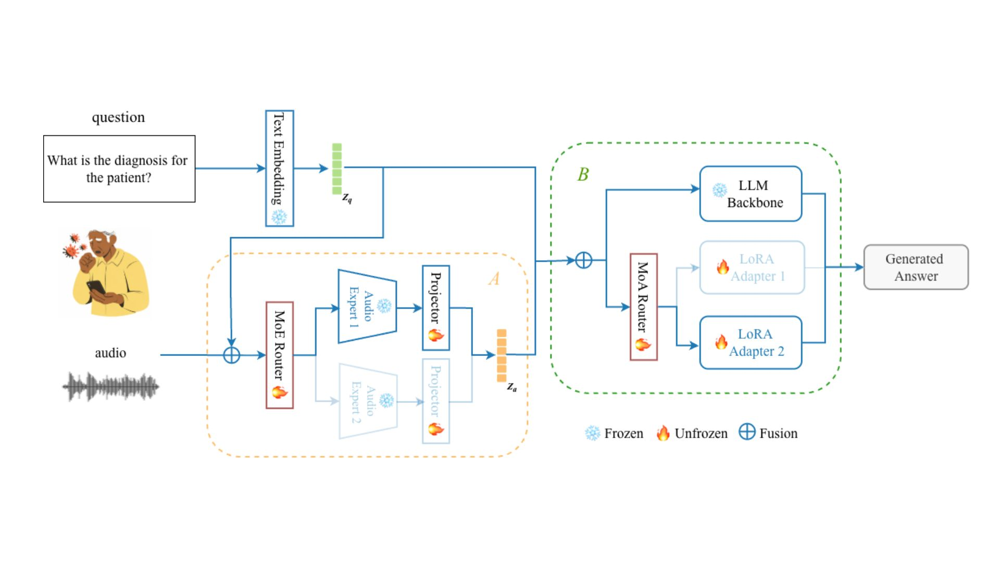

# RAMoEA-QA: Hierarchical Specialization for Robust Respiratory Audio Question Answering

  

  <b>Generative respiratory-audio question-asnwering with two-stage conditional specialization:</b> 
  <i>Audio Mixture-of-Experts</i> (select 1 audio encoder) + <i>Language Mixture-of-Adapters</i> (select 1 LoRA on a frozen LLM)

  <!-- Replace placeholders below with your actual links -->
  <!-- <a href="https://arxiv.org/abs/XXXX.XXXXX">Paper</a> •-->
  
<!---->
 <!-- <a href="#citation">Citation</a> •
  <a href="#reproducing-paper-results">Reproduce</a>-->

 

---

## 🔥 What is RAMoEA-QA?

**RAMoEA-QA** is a **hierarchical generative** multimodal model for **Respiratory Audio Question Answering** that **unifies multiple question types** (open-ended, single-verify, multiple-choice) and supports **both discrete labels and continuous targets** in a single system.

Instead of a single monolithic pathway, RAMoEA-QA applies a **per-example two-stage conditional specialization**:

- **Audio MoE (Audio Mixture-of-Experts):** routes each *(audio, question)* example to **one** pre-trained audio encoder expert.
- **Language MoA (Mixture-of-Adapters):** selects **one** LoRA adapter on a **shared frozen LLM backbone** to match query intent and answer format.

This yields **specialization per example** with **minimal parameter overhead** (only LoRA + light alignment/routing modules), improving robustness under **modality**, **dataset/device**, and **task** shifts.

---

## ✨ Key Features

- **Generative QA**: produces natural-language answers while supporting strict **label/value parsing** for evaluation.
- **Hierarchical routing**: **Audio-MoE → MoA** (coarse acoustic/domain choice → generation/format refinement).
- **Single-model, multi-task**: handles diagnosis, severity-style outputs, and regression targets.
- **Robustness-oriented**: designed to generalize across **recording conditions** and **question intents**.

---
This code utilize the [OPERA framework](https://github.com/evelyn0414/OPERA)[1] for the audio encoding, and you can put this directory under `src/benchmark`, and the [RA-QA](Bertolino_Zang_Xia_Talia_Mascolo_2026,)[2] dataset.

[1] Zhang, Yuwei, et al. "Towards Open Respiratory Acoustic Foundation Models: Pretraining and Benchmarking." arXiv preprint arXiv:2406.16148 (2024).

[2] Bertolino, G. A., et al. "RA-QA: Towards Respiratory Audio-based Health Question Answering." Zenodo. https://doi.org/10.5281/zenodo.18489541 (2026).
